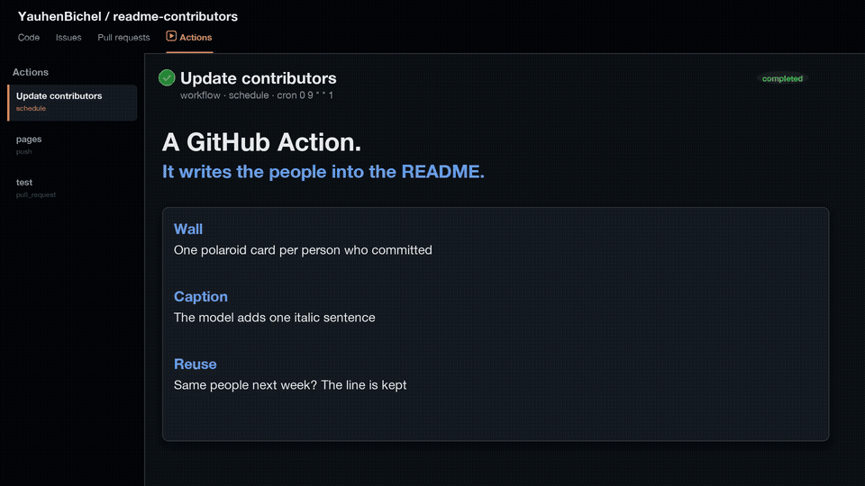

# README contributors

[](https://github.com/YauhenBichel/readme-contributors/actions/workflows/ci.yml)
[](https://github.com/YauhenBichel/readme-contributors/graphs/contributors)
[](./LICENSE)
[](https://github.com/marketplace/actions/readme-contributors)
[](https://yauhenbichel.github.io/readme-contributors/)
[](https://github.com/YauhenBichel/readme-contributors/labels/good%20first%20issue)

Marketplace: [readme-contributors](https://github.com/marketplace/actions/readme-contributors) · Site: [yauhenbichel.github.io/readme-contributors](https://yauhenbichel.github.io/readme-contributors/)

A **GitHub Action** that draws a **contributors** wall into your
**README**: one clickable **polaroid sticker** per person (face plus
name), plus SVG layouts for Pages (facepile, stickers, grid, tiles,
orbit, honeycomb, and more). It reads the GitHub contributors API,
adds the person who just landed and merged pull request authors
(plus `Co-authored-by` trailers on those PRs) when that list is
behind, omits bots, honors `exclude`, and replaces a pair of HTML
markers. An empty wall writes “Be the first to appear here.”
No `<table>`, so GitHub does not draw a grid. No third-party list
service.

[](https://yauhenbichel.github.io/readme-contributors/#demo)

## What

A **GitHub Action** that fills a README with the people the GitHub
contributors API lists (plus merged-PR authors when that list is
behind). Each person is a **polaroid**: face, name, a bit of tilt.
Each card is its own link. Bots are omitted. `exclude` drops named
logins. Merged PR `Co-authored-by` trailers join the wall. An empty
list writes “Be the first to appear here.” Hover a cut name to see
the full one. `caption: auto` asks a model for one sentence that
names this repository or the people on the wall; stock “dedicated
individuals” lines are dropped. No `<table>`. No third-party list service.

Watch the 18s demo (GitHub README plays this as a GIF; the MP4 is on
[Pages](https://yauhenbichel.github.io/readme-contributors/#demo)):

[](https://yauhenbichel.github.io/readme-contributors/#demo)

## Why

GitHub cannot click a face inside one SVG. One picture is one link.
A `wall.svg` with six heads looks clickable. It is not.

This Action writes one card per person. Tap it, you land on their
GitHub profile.

## How

1. Put markers in `README.md`:

```markdown
<!-- readme: contributors,bots/- -start -->
<!-- readme: contributors,bots/- -end -->
```

2. Call the Action. Pin the tag to read. Pin the SHA if the job can write:

```yaml
- uses: YauhenBichel/readme-contributors@06d127a2e5ea32a9d8d6c4a00944d14cf6ea239e # v1.7.0
  with:
    token: ${{ secrets.GITHUB_TOKEN }}
    format: html
    # exclude: ghost
    # caption: auto
```

3. Commit the rewritten README and `.github/faces`.

A full copy-paste job is in
[examples/contributors.yml](./examples/contributors.yml).
The Pages how-to is
[yauhenbichel.github.io/readme-contributors](https://yauhenbichel.github.io/readme-contributors/#use).

## Examples

- Live tap-the-cards wall:
  [yauhenbichel.github.io/readme-contributors/#live](https://yauhenbichel.github.io/readme-contributors/#live)
- [YauhenBichel/py-harness](https://github.com/YauhenBichel/py-harness) — 6 people, this demo wall
- [MoleCare/molecare-mcp](https://github.com/MoleCare/molecare-mcp) — different 6 people
- [MoleCare/molecare-skin-llm](https://github.com/MoleCare/molecare-skin-llm)
- [MoleCare/molecare-ml](https://github.com/MoleCare/molecare-ml)
- [MoleCare/molecare-desktop](https://github.com/MoleCare/molecare-desktop)

MoleCare repos are open source. Not a medical device.

## Live demo

This wall is produced by **this Action**, live, from the
[py-harness](https://github.com/YauhenBichel/py-harness) contributors
API (bots omitted). It refreshes on a schedule. That is the picture
other repositories get.

<!-- demo: live -start -->
<p align="center">
  <a href="https://github.com/YauhenBichel" title="Yauhen Bichel" aria-label="Yauhen Bichel"></a>
  <a href="https://github.com/xianjianlf2" title="Mark Xian" aria-label="Mark Xian"></a>
  <a href="https://github.com/ItzSaurav" title="Itzsaurav" aria-label="Itzsaurav"></a>
  <a href="https://github.com/svkzn" title="svkzn" aria-label="svkzn"></a>
  <a href="https://github.com/Aditya-233" title="Aditya" aria-label="Aditya"></a>
  <a href="https://github.com/kkkhs" title="Huangshuo Kuang" aria-label="Huangshuo Kuang"></a>
</p>
<p align="center"><em>The contributors to the py-harness project include Yauhen Bichel, Mark Xian, Itzsaurav, svkzn, Aditya, and Huangshuo Kuang.</em></p>
<!-- demo: live -end -->

Examples for every layout live on the
[GitHub Pages site](https://yauhenbichel.github.io/readme-contributors/).
Issues and pull requests belong **here**.

## Used by

These public repositories pin this Action on their **default branch**.
GitHub does not show a Used-by graph for Actions, so this list is the
source of truth.

- [YauhenBichel/py-harness](https://github.com/YauhenBichel/py-harness) — everyday laptop harness. The live demo above is its wall.
- [YauhenBichel/merge-cheer](https://github.com/YauhenBichel/merge-cheer) — merge-celebration Action.
- [YauhenBichel/readme-contributors](https://github.com/YauhenBichel/readme-contributors) — this repository (dogfood).
- [MoleCare/molecare-mcp](https://github.com/MoleCare/molecare-mcp)
- [MoleCare/molecare-skin-llm](https://github.com/MoleCare/molecare-skin-llm)
- [MoleCare/molecare-ml](https://github.com/MoleCare/molecare-ml)
- [MoleCare/molecare-desktop](https://github.com/MoleCare/molecare-desktop)

[Search every public workflow that pins it](https://github.com/search?q=YauhenBichel%2Freadme-contributors%40+path%3A.github%2Fworkflows&type=code).

## Layouts

Set `layout`. The default is `auto`: **facepile** up to 8 people,
**grid** up to 24, **compact** after that. The README wall is always
clickable polaroids. Faces shrink at 20 and 50 people so the row still
wraps. From 12 people up, a name list sits under the faces so every
person stays a link. `max` defaults to 100 (set `0` for up to 500).
Contributor and closed-PR lists are paged up to that cap.
`layout` still changes the SVG drawn for Pages.

**stickers** — tilted cards with a chunky ring and a drop shadow.

<p align="center">
  
</p>

**grid** — spaced circles, one row until `columns`.

<p align="center">
  
</p>

**tiles** — rounded squares.

<p align="center">
  
</p>

**list** — avatar, name, and login on each row.

<p align="center">
  
</p>

**compact** — a tighter grid for a long list.

<p align="center">
  
</p>

**wave** — a sine-staggered row.

<p align="center">
  
</p>

**orbit** — first person in the middle, the rest on a ring.

<p align="center">
  
</p>

**honeycomb** — hex tiles on offset rows.

<p align="center">
  
</p>

**ribbon** — a zipper that steps up and down.

<p align="center">
  
</p>

**constellation** — faces with faint links between neighbours.

<p align="center">
  
</p>

**banner** — the first person is larger; the others sit beside them.

<p align="center">
  
</p>

```yaml
- uses: YauhenBichel/readme-contributors@v1.7.0
  with:
    token: ${{ secrets.GITHUB_TOKEN }}
    layout: tiles
```

## Themes

Set `theme`. `auto` follows the reader's light or dark README. The
others paint a frame so the wall stays the same in both.

<p align="center">
  
  
</p>
<p align="center">
  
  
</p>
<p align="center">
  
</p>

```yaml
- uses: YauhenBichel/readme-contributors@v1.7.0
  with:
    token: ${{ secrets.GITHUB_TOKEN }}
    layout: facepile
    theme: midnight
```

`theme` accepts `auto`, `github`, `midnight`, `sunrise`, `forest`,
`ocean`, or `mono`.

## Use it

Add markers to your README:

```markdown
## Contributors

Thank you to everyone who has helped.

<!-- readme: contributors,bots/- -start -->
<!-- readme: contributors,bots/- -end -->
```

Then call the Action. Pin it to a commit SHA when the job has
`contents: write`.

```yaml
name: Contributors

on:
  schedule:
    - cron: "17 4 * * 0"
  workflow_dispatch:

permissions:
  contents: write

jobs:
  readme:
    runs-on: ubuntu-latest
    steps:
      - uses: actions/checkout@v7
      - uses: YauhenBichel/readme-contributors@06d127a2e5ea32a9d8d6c4a00944d14cf6ea239e # v1.7.0
        with:
          token: ${{ secrets.GITHUB_TOKEN }}
          # layout: tiles
          # theme: midnight
          # caption: auto
          # model: gpt-4o-mini
          # model-api-key: ${{ secrets.OPENAI_API_KEY }}
      - run: |
          git config user.name github-actions[bot]
          git config user.email 41898282+github-actions[bot]@users.noreply.github.com
          git add README.md .github/contributors.svg .github/faces
          git diff --cached --quiet && exit 0
          git commit -m "docs: refresh README contributors"
          git push
```

For every repository, including one with a protected default branch, copy
[examples/contributors.yml](./examples/contributors.yml). It calls the
reusable wall, which writes straight to the default branch after each merge —
no separate pull request. On a protected branch, add a write deploy key,
store it as `CONTRIBUTORS_DEPLOY_KEY`, and let deploy keys bypass the ruleset.
If your repository is not under `YauhenBichel`, `secrets: inherit` will not reach
the wall — GitHub only passes inherited secrets within one organisation — so pass
the key by name: `secrets: { CONTRIBUTORS_DEPLOY_KEY: ${{ secrets.CONTRIBUTORS_DEPLOY_KEY }} }`.
Do not run the wall on `pull_request`: a wall drawn on a pull request branch is
stale by the time it merges if anything else merged first.
The Action only writes files in the workspace. Your workflow decides
whether to commit them. The full case list is on the
[site](https://yauhenbichel.github.io/readme-contributors/#cases).

### Use a model

The wall stays rule-based. Add repository secret `OPENAI_API_KEY` and
copy [examples/contributors-openai.yml](./examples/contributors-openai.yml).

[](https://yauhenbichel.github.io/readme-contributors/#ai)

21 seconds. The people stay. The model adds one sentence.

This is the model path. Zero-config leaves the wall with no caption.

**What.** The wall is still the people the contributors API lists. The
model writes one italic line that names this repository or those
people.

**Why.** A headcount is not a story. A caption that says who showed
up is.

**How.** `caption: auto` and `gpt-4o-mini`. Same people next week?
The line is reused. No extra credits.

Live on this README:

- *The contributors to the py-harness project include Yauhen Bichel, Mark Xian, Itzsaurav, svkzn, Aditya, and Huangshuo Kuang.*
- *Yauhen Bichel and HeaTTap have contributed to the readme-contributors project.*

```yaml
- uses: YauhenBichel/readme-contributors@e4468b5b0cc0f8b87f0b083bc13efc9289ff7ecd
  with:
    token: ${{ secrets.GITHUB_TOKEN }}
    caption: auto
    model: gpt-4o-mini
    model-api-key: ${{ secrets.OPENAI_API_KEY }}
```

Pin that SHA until the next release. `@v1.7.0` can call a model but
only sees a headcount. Stock “dedicated individuals” lines are
dropped. A missing key or a 429 leaves no caption — it is not
retried.

### Keep credits low

A caption that still names this repository or a listed person is
reused when the people list is unchanged (no second call). Same
people plus a missing or stock line gets one call. Use
`gpt-4o-mini`. One secret, one `caption: auto` step, weekly cron
only. Do not run `caption: auto` on `push` to `README.md` or the
wording will refresh itself.

## Contribute

This repository is public and Apache-2.0. Fork it, pick a
[`good first issue`](https://github.com/YauhenBichel/readme-contributors/labels/good%20first%20issue),
and open a pull request. See [CONTRIBUTING.md](./CONTRIBUTING.md).

```bash
git clone https://github.com/YauhenBichel/readme-contributors.git
cd readme-contributors
python3 -m unittest discover -s tests -q
```

No token, no GPU, no extra packages. `fill.py` is stdlib only.

## Inputs

| Input | Default | Meaning |
| --- | --- | --- |
| `readme` | `README.md` | File that holds the markers |
| `svg` | `.github/contributors.svg` | Generated wall (when `format` is `svg`) |
| `faces` | `.github/faces` | One polaroid SVG per person. Stale files are removed when a login leaves the wall |
| `format` | `svg` | README icons always link to profiles; `html` skips the combined SVG file |
| `layout` | `auto` | `auto` picks facepile / grid / compact by count; or pin `facepile`, `stickers`, `grid`, `tiles`, `list`, `compact`, `wave`, `orbit`, `honeycomb`, `ribbon`, `constellation`, `banner` |
| `theme` | `auto` | `auto`, `github`, `midnight`, `sunrise`, `forest`, `ocean`, `mono` |
| `columns` | `8` | Faces per row |
| `avatar-size` | `72` | Face diameter, pixels |
| `overlap` | `0.64` | Facepile step as a fraction of `avatar-size`. `1` sits faces side by side. Pages SVG only |
| `max` | `100` | Cap after bots are omitted. `0` means 500. Contributor and closed-PR lists are paged up to the cap |
| `exclude` | empty | Comma-separated logins to omit (case-insensitive, after bots) |
| `caption` | empty | `auto` writes one sentence that names the repo or people when a model key is set. A still-valid line is reused when the people list is unchanged |
| `model` | empty | Optional OpenAI-compatible chat model for `caption: auto` |
| `model-api-key` | empty | Optional OpenAI-compatible key |
| `model-base-url` | empty | Optional OpenAI-compatible API root |
| `repository` | the current repo | `owner/name` to read |
| `token` | `github.token` | Raises the API rate limit |
| `check` | `false` | Exit 1 if the files would change |
| `marker-start` / `marker-end` | the comments above | Override the markers |

## Outputs

| Output | Meaning |
| --- | --- |
| `count` | People written |
| `changed` | `true` when the README or SVG was rewritten |

## Locally

```bash
GITHUB_REPOSITORY=owner/name GITHUB_TOKEN="$GITHUB_TOKEN" \
  python3 fill.py
```

Set `CHECK=true` for the `check` input.

## Contributors

Thank you to everyone who has helped this Action.

<!-- readme: contributors,bots/- -start -->
<p align="center">
  <a href="https://github.com/YauhenBichel" title="Yauhen Bichel" aria-label="Yauhen Bichel"></a>
  <a href="https://github.com/HeaTTap" title="HeaTTap" aria-label="HeaTTap"></a>
</p>
<p align="center"><em>Yauhen Bichel and HeaTTap have contributed to the readme-contributors project.</em></p>
<!-- readme: contributors,bots/- -end -->

Filled from the GitHub contributors API (bots omitted).
