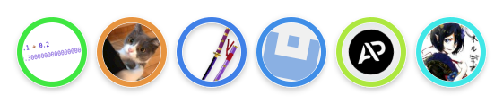
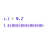

# README contributors

[](https://github.com/YauhenBichel/readme-contributors/actions/workflows/ci.yml)
[](./LICENSE)
[](https://github.com/marketplace/actions/readme-contributors)
[](https://yauhenbichel.github.io/readme-contributors/)
[](https://github.com/YauhenBichel/readme-contributors/labels/good%20first%20issue)

A **GitHub Action** that draws a **contributors** wall into your
**README**: circular **SVG** avatars (facepile, grid, tiles, orbit,
honeycomb, and more). It reads the GitHub contributors API, omits
bots, and replaces a pair of HTML markers. No `<table>`, so GitHub
does not draw a grid. No third-party list service.

Examples and copy-paste workflows:
[yauhenbichel.github.io/readme-contributors](https://yauhenbichel.github.io/readme-contributors/).

Any public repository can pin the
[v1.3.0 release](https://github.com/YauhenBichel/readme-contributors/releases/tag/v1.3.0):

```yaml
- uses: YauhenBichel/readme-contributors@v1.3.0
  with:
    token: ${{ secrets.GITHUB_TOKEN }}
```

GitHub draws a border on every README `<table>`. This Action does not
use a table. The default is a self-contained SVG facepile (circular
avatars, light and dark rings) plus a linked name row so each person
stays clickable.

## Live demo

This wall is produced by **this Action**, live, from the
[py-harness](https://github.com/YauhenBichel/py-harness) contributors
API (bots omitted). It refreshes on a schedule. That is the picture
other repositories get.

<!-- demo: live -start -->
<p align="center">
  
</p>
<p align="center">
  <a href="https://github.com/YauhenBichel">Yauhen Bichel</a><span> · </span><a href="https://github.com/xianjianlf2">Mark Xian</a><span> · </span><a href="https://github.com/ItzSaurav">Itzsaurav</a><span> · </span><a href="https://github.com/svkzn">svkzn</a><span> · </span><a href="https://github.com/Aditya-233">Aditya</a><span> · </span><a href="https://github.com/kkkhs">Huangshuo Kuang</a>
</p>
<!-- demo: live -end -->

Examples for every layout live on the
[GitHub Pages site](https://yauhenbichel.github.io/readme-contributors/).
Issues and pull requests belong **here**.

## Used by

These public repositories pin this Action on their **default branch**.
GitHub does not show a Used-by graph for Actions, so this list is the
source of truth.

- [YauhenBichel/py-harness](https://github.com/YauhenBichel/py-harness) — everyday laptop harness. The live demo above is its wall.
- [YauhenBichel/merge-cheer](https://github.com/YauhenBichel/merge-cheer) — merge-celebration Action.
- [YauhenBichel/readme-contributors](https://github.com/YauhenBichel/readme-contributors) — this repository (dogfood).

[Search every public workflow that pins it](https://github.com/search?q=YauhenBichel%2Freadme-contributors%40+path%3A.github%2Fworkflows&type=code).

[MoleCare](https://github.com/MoleCare) (`molecare-mcp`, `molecare-skin-llm`, `molecare-desktop`, `molecare-ml`) and other public repos have open adoption pull requests. They appear in the search above once those PRs merge.

## Layouts

Set `layout`. The default stays the overlapping facepile.

**grid** — spaced circles, one row until `columns`.

<p align="center">
  
</p>

**tiles** — rounded squares.

<p align="center">
  
</p>

**list** — avatar, name, and login on each row.

<p align="center">
  
</p>

**compact** — a tighter grid for a long list.

<p align="center">
  
</p>

**wave** — a sine-staggered row.

<p align="center">
  
</p>

**orbit** — first person in the middle, the rest on a ring.

<p align="center">
  
</p>

**honeycomb** — hex tiles on offset rows.

<p align="center">
  
</p>

**ribbon** — a zipper that steps up and down.

<p align="center">
  
</p>

**constellation** — faces with faint links between neighbours.

<p align="center">
  
</p>

**banner** — the first person is larger; the others sit beside them.

<p align="center">
  
</p>

```yaml
- uses: YauhenBichel/readme-contributors@v1.3.0
  with:
    token: ${{ secrets.GITHUB_TOKEN }}
    layout: tiles
```

## Themes

Set `theme`. `auto` follows the reader's light or dark README. The
others paint a frame so the wall stays the same in both.

<p align="center">
  
  
</p>
<p align="center">
  
  
</p>
<p align="center">
  
</p>

```yaml
- uses: YauhenBichel/readme-contributors@v1.3.0
  with:
    token: ${{ secrets.GITHUB_TOKEN }}
    layout: facepile
    theme: midnight
```

`theme` accepts `auto`, `github`, `midnight`, `sunrise`, `forest`,
`ocean`, or `mono`.

## Use it

Add markers to your README:

```markdown
## Contributors

Thank you to everyone who has helped.

<!-- readme: contributors,bots/- -start -->
<p align="center">
  
</p>
<p align="center">
  <a href="https://github.com/YauhenBichel">Yauhen Bichel</a>
</p>
<!-- readme: contributors,bots/- -end -->
```

Then call the Action. Pin it to a commit SHA when the job has
`contents: write`.

```yaml
name: Contributors

on:
  schedule:
    - cron: "17 4 * * 0"
  workflow_dispatch:

permissions:
  contents: write

jobs:
  readme:
    runs-on: ubuntu-latest
    steps:
      - uses: actions/checkout@v7
      - uses: YauhenBichel/readme-contributors@v1.3.0
        with:
          token: ${{ secrets.GITHUB_TOKEN }}
          # layout: tiles
          # theme: midnight
      - run: |
          git config user.name github-actions[bot]
          git config user.email 41898282+github-actions[bot]@users.noreply.github.com
          git add README.md .github/contributors.svg
          git diff --cached --quiet && exit 0
          git commit -m "docs: refresh README contributors"
          git push
```

A copy-paste workflow that opens a pull request on a protected default
branch is in [examples/contributors.yml](./examples/contributors.yml).
The Action only writes files in the workspace. Your workflow decides
whether to commit them.

## Contribute

This repository is public and Apache-2.0. Fork it, pick a
[`good first issue`](https://github.com/YauhenBichel/readme-contributors/labels/good%20first%20issue),
and open a pull request. See [CONTRIBUTING.md](./CONTRIBUTING.md).

```bash
git clone https://github.com/YauhenBichel/readme-contributors.git
cd readme-contributors
python3 -m unittest discover -s tests -q
```

No token, no GPU, no extra packages. `fill.py` is stdlib only.

## Inputs

| Input | Default | Meaning |
| --- | --- | --- |
| `readme` | `README.md` | File that holds the markers |
| `svg` | `.github/contributors.svg` | Generated wall (when `format` is `svg`) |
| `format` | `svg` | `svg` for a drawn wall, `html` for linked avatars only |
| `layout` | `facepile` | `facepile`, `grid`, `tiles`, `list`, `compact`, `wave`, `orbit`, `honeycomb`, `ribbon`, `constellation`, `banner` |
| `theme` | `auto` | `auto`, `github`, `midnight`, `sunrise`, `forest`, `ocean`, `mono` |
| `columns` | `8` | Faces per row |
| `avatar-size` | `72` | Face diameter, pixels |
| `max` | `48` | Cap after bots are omitted |
| `repository` | the current repo | `owner/name` to read |
| `token` | `github.token` | Raises the API rate limit |
| `check` | `false` | Exit 1 if the files would change |
| `marker-start` / `marker-end` | the comments above | Override the markers |

## Outputs

| Output | Meaning |
| --- | --- |
| `count` | People written |
| `changed` | `true` when the README or SVG was rewritten |

## Locally

```bash
GITHUB_REPOSITORY=owner/name GITHUB_TOKEN="$GITHUB_TOKEN" \
  python3 fill.py
```

Set `CHECK=true` for the `check` input.

## Contributors

Thank you to everyone who has helped this Action.

<!-- readme: contributors,bots/- -start -->
<p align="center">
  
</p>
<p align="center">
  <a href="https://github.com/YauhenBichel">Yauhen Bichel</a>
</p>
<!-- readme: contributors,bots/- -end -->

Filled from GitHub commits (bots omitted).
